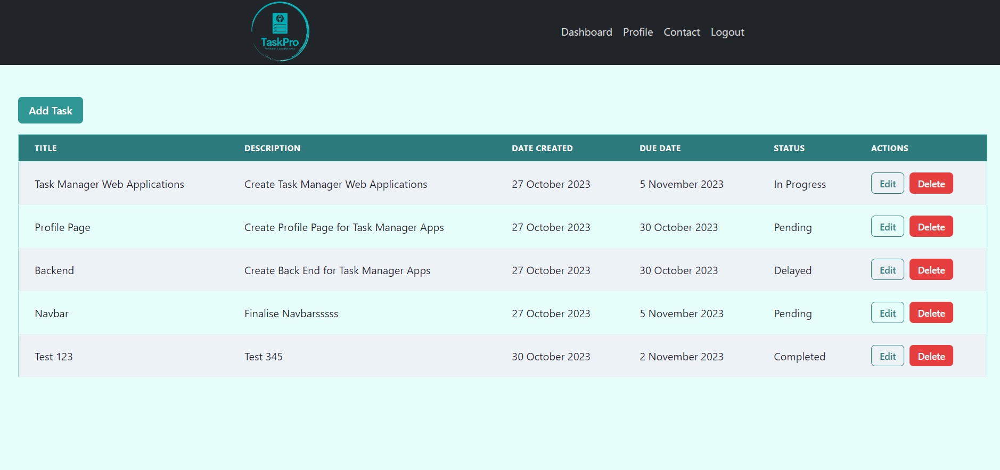

# Team 5 Task Manager - Task Pro

## Table of Contents

1. [Description](#description)
2. [User Story](#user-story)
3. [Acceptance Criteria](#acceptance-criteria)
4. [Installation and Running the Application](#installation-and-running-the-application)
5. [Repository Link](#repository-link)
6. [Deploy Link](#deploy-link)
7. [Contributors](#contributors)
8. [Screenshot](#screenshot)
9. [Technologies](#technologies)
10. [Questions](#questions)

## Description

Task Pro is a comprehensive task management system aimed at enhancing productivity and organizing tasks effectively. If you're juggling multiple tasks and projects and struggling to keep everything in place, Task Pro is here to streamline your workflow. The intuitive user interface makes it easy to create and manage tasks.

## User Story

```
AS A user
I WANT to manage my tasks in an organized manner
SO THAT I can keep track of my tasks and improve productivity.
```

## Acceptance Criteria

```
GIVEN a new user wants to access the Task Manager
WHEN they provide valid registration details
THEN they can register and log in.

GIVEN a logged-in user
WHEN they want to manage tasks
THEN they can add, delete, update, and view tasks.

GIVEN a user creates or modifies a task
WHEN the task data is sent to the server
THEN the tasks are stored persistently in a database.

GIVEN a registered user
WHEN they use their email and password to log in
THEN they can access the dashboard and edit or update their profile.

GIVEN a user wants to create a new task
WHEN they provide the title, description, and due date for the task
THEN a new task is created.

GIVEN a user views their tasks
WHEN they choose to edit or delete a task
THEN the selected task is edited or deleted.

GIVEN a logged-in user
WHEN they select the logout option
THEN they are logged out from the Task Manager.

GIVEN a user with a device such as a desktop, tablet, or mobile phone
WHEN they access the Task Manager
THEN the app is accessible and responsive.
```

## Installation and Running the Application

1. Navigate to the root directory of the project.
2. Run `npm install` to install all dependencies.
3. Run `npm run develop` to start both client and server.
4. The client will be available at `http://localhost:3000` and the GraphQL API will be accessible at `http://localhost:4000`.

## Repository Link

[Team 5 Task Manager Repository](https://github.com/AllenHirmiz/Team-5-Task-Manager)

## Deploy Link

[Deployed Application on Heroku](https://task-pro-g5-d3c5f7289792.herokuapp.com/)

## Contributors

- [Allen Hirmiz](https://github.com/AllenHirmiz)
- [Meriam Sadio](https://github.com/msadio8)
- [Christian Setiawan](https://github.com/csetiawan88)

## Screenshot

**Task Pro Front Page**


**Dashboard**


**Profile**


**Contact**


## Technologies

- [Apollo Client & Server](https://www.apollographql.com/)
- [Bcrypt](https://www.npmjs.com/package/bcrypt)
- [Bootstrap](https://getbootstrap.com/)
- [Chakra-UI](https://chakra-ui.com/)
- [Express](https://expressjs.com/)
- [GraphQL](https://graphql.org/)
- [JSON Web Token](https://www.npmjs.com/package/jsonwebtoken)
- [Mongoose](https://mongoosejs.com/)
- [Node.js](https://nodejs.org/)
- [React](https://reactjs.org/)

## Questions

For questions or feedback, please reach out to:

- Allen - [allenihirmiz@gmail.com](mailto:allenihirmiz@gmail.com)

- Meriam - [meriam.sadio8@gmail.com](mailto:meriam.sadio8@gmail.com)

- Christian - [csetiawan@yahoo.com](mailto:csetiawan@yahoo.com)
